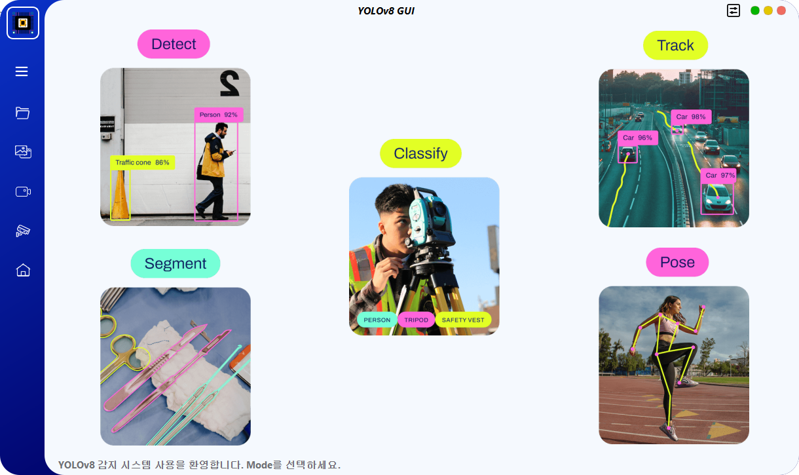

# YoloSide ~ A GUI For YOLOv8 `V2.5`
---
<p align="center"> 
  <a href="https://github.com/songminkyu/YOLOv8-PySide-GUI/blob/main/README.md"> English</a> &nbsp; | &nbsp; 한국어</a>
 </p>



## 개발 환경
### 1. 가상 환경 만들기

Python3.11 버전의 가상 환경을 생성한 후 환경을 시작합니다.

```shell
conda create --name yolov8-gui python=3.11
conda activate yolov8-gui
```
### 2. 종속성 패키지 설치

```shell
pip install pyside6
pip install chardet
pip install pytube
pip install ultralytics == 8.2.86
pip install torch==2.3.1 torchvision==0.18.1 torchaudio==2.3.1 --index-url https://download.pytorch.org/whl/cu118
```

### 3. 실행 프로그램
한국어
```shell
python main_kr.py
```
English
```shell
python main_en.py
```

## Pack
### 1. 가상 환경 만들기

가상 환경을 생성하고 python3.11을 설치하려면 기본 Python을 사용하는 것이 좋습니다.
```shell
python -m venv venv
(your YOLOv8-GUI-PySide6-main PATH)\venv\Scripts\activate.bat
```

## 2. 종속성 패키지 설치

```shell
pip install pyside6
pip install chardet
pip install pytube
pip install ultralytics == 8.2.86
pip install torch==2.3.1 torchvision==0.18.1 torchaudio==2.3.1 --index-url https://download.pytorch.org/whl/cu118
pip install lapx
pip install auto-py-to-exe
```

### 3. auto-py-to-exe UI 인터페이스를 시작합니다.

```shell
auto-py-to-exe
```

### 4. 스크립트 위치 및 추가 파일 추가

스크립트 위치
```shell
(your YOLOv8-GUI-PySide6-main PATH)\main.py
```

파일을 첨부하고 프로젝트 추가를 클릭하세요.
```shell
(your YOLOv8-GUI-PySide6-main PATH)\venv\Lib\site-packages\ultralytics
```

변환하려면 클릭하세요.

### 5. 파일 복사
`conig`, `img`, `models`, `ui`, `utils`를 `(your YOLOv8-GUI-PySide6-main PATH)\output\main`에 복사합니다.

### 6. main.exe를 시작합니다.
main.exe를 실행하여 애플리케이션을 시작합니다.

## 메모
- `ultralytics`는 `AGPL-3.0`을 준수하므로 상업적 이용이 필요한 경우 라이센스를 취득해야 합니다.
- 자체 모델을 사용하려면 'ultralytics'를 사용하여 yolov5/6(only det)/8/9(det&seg)/10(only det) 모델을 먼저 학습시킨 다음 학습된 `를 전송해야 합니다. pt` 파일 `models/*` 폴더에 넣으세요.
- 소프트웨어에는 아직 몇 가지 버그가 있습니다. 시간이 허락하는 대로 계속해서 더 흥미로운 기능을 최적화하고 추가하겠습니다.
- 테스트 결과를 저장했다면 `./run` 경로에 저장됩니다.
- UI 디자인 파일은 `home.ui`입니다. 수정된 경우 `pyside6-uic home.ui > ui/home.py` 명령을 사용하여 `.py` 파일을 다시 생성해야 합니다.
- 리소스 파일은 `resources.qrc`입니다. 기본 아이콘을 수정하는 경우 `pyside6-rcc resoures.qrc > ui/resources_rc.py` 명령을 사용하여 `.py` 파일을 다시 생성해야 합니다.
- 회전 프레임 모드는 '감지 모드'입니다. 자신만의 학습된 obb 모델을 사용하려면 'yolov8n-obb.pt'와 같이 파일 이름에 'obb'를 추가해야 합니다. 일반 감지 모드로만 들어가십시오.

## 기존 기능
### 1. 모드 선택
- 이미지 분류
- 물체 감지
- 객체 감지(OBB)
- 자세 감지
- 인스턴스 분할
- 표적 추적

### 2.데이터 입력 방법
- 단일 파일 감지 기능
- 폴더(일괄) 감지 기능
- 드래그 파일 입력 지원
- 입력 카메라 지원
- `chose_rtsp`, `load_rtsp` 기능 지원

## To Do
- [ ] Monitor system hardware usage
- [ ] Graph showing changes in target quantity
- [ ] Sqlite3 Record

## 참고자료
- [PyQt5-YOLOv5](https://github.com/Javacr/PyQt5-YOLOv5)
- [ultralytics](https://github.com/ultralytics/ultralytics)
- [PySide6-YOLOv8](https://github.com/Jai-wei/YOLOv8-PySide6-GUI/tree/main)
- [YOLOSHOW](https://github.com/SwimmingLiu/YOLOSHOW/tree/31644373fca58aefcc9dba72a610c92031e5331b)
